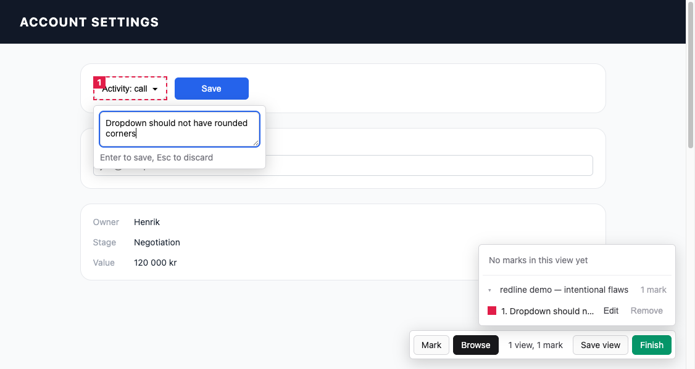

# redline

> **Experimental branch:** the original overlay below remains intact. This branch
> also contains a separate Chrome extension for designer-to-developer handoff.
> Start with [EXPERIMENT.md](EXPERIMENT.md).

Design QA for agent-written interfaces. Mark a region on a live page, write one
short instruction, and continue reviewing. Redline turns those marks into a
structured queue with coordinates, computed styles, selectors, and framework
metadata that a coding agent can implement and verify.

The human makes the judgement. The agent changes the code. The queue is the
contract between them.

Redline is not an MCP server. It is a dependency-free browser overlay that can be
operated manually or through an MCP/browser-capable coding agent.



## Why redline

General annotation tools are designed for comments between people. Visual builders
are designed to generate UI. Redline is deliberately narrower: every comment is a
task for an implementation agent and carries technical evidence from the marked
page.

`overlay.js` is the complete distributed tool: one vanilla JavaScript IIFE, no
runtime dependencies, server, account, or build step.

## Security and privacy

Read this before using Redline on a live application:

- Injected code has the same access to the page as code pasted into DevTools.
- A queue can contain page URLs, visible DOM text, selectors, computed styles, and
  React component/source metadata.
- Queues are stored in the current site's `localStorage` and exposed as
  `window.__redlineQueue`. Scripts running on that origin can read them.
- Redline does not upload the queue, but local-only storage does not make sensitive
  page content harmless. Avoid customer-data or production pages unless this capture
  and retention model is acceptable.
- Audit the exact `overlay.js` you run. The documented workflow never injects a
  mutable remote `main` branch into an authenticated tab.

## Install and run

Choose one of these local, auditable methods:

### DevTools console or Snippet

Download or clone a reviewed Redline revision. Paste the contents of `overlay.js`
into the target tab's DevTools console, or save it as a DevTools Snippet for reuse.
Console injection also works on many applications whose Content Security Policy
blocks remote script tags.

### Coding agent

Give your agent access to this repository and say:

> Start a Redline review on the current page using the local `overlay.js`.

The agent should read the local file and inject its contents into the target tab.
See [AGENT.md](AGENT.md) for the full workflow.

Redline intentionally does not publish a bookmarklet that loads `@main`. A remote
bookmarklet has full access to the current tab and can change after it has been
installed. If you operate your own loader, pin and audit an immutable artifact.

Running `overlay.js` again while a review is active reuses the current instance. A
full teardown removes the instance's timers and global event listeners.

## Review workflow

1. Open the page or application state to review.
2. Inject the local `overlay.js`.
3. Use the toolbar:
   - **Mark**: draw a rectangle, enter an instruction, and press Enter. Shift+Enter
     inserts a newline; Esc discards the draft.
   - **Browse**: pass pointer events through to the application so you can open a
     menu, modal, date picker, or another state.
   - **Counter**: open the review panel. Current and saved marks can be located,
     edited, or removed.
   - **Save view**: archive the current page/state and continue reviewing.
   - **Finish**: archive remaining marks, persist the queue, remove review frames,
     and show copy, reopen, and close actions.
4. Tell the agent when the review is finished.

Keyboard shortcuts are `r` for Mark, `b` for Browse, and Esc to leave Mark mode.
Shortcuts are ignored while typing in either the page or Redline.

### Multi-page and SPA reviews

One review can contain many views. Each view retains its own URL, title, viewport,
scroll position, and marks.

- Save view persists incrementally.
- SPA URL changes auto-archive unsaved marks under the URL where they were created.
- A hard reload removes the overlay but keeps successfully saved views in
  `localStorage`; reinjecting resumes them.
- Finish followed by Reopen restores the same in-memory review without duplicating
  global listeners.

If persistence is blocked or full, Redline reports that the review is only available
in memory and keeps copy/export actions available. It does not label the queue as
durably saved.

## Agent handoff

After Finish, choose **Copy agent prompt**. The copied prompt contains:

- implementation/triage instructions;
- the full queue JSON;
- the exact running `overlay.js` source required to reopen the review visually.

The receiver therefore does not fetch a mutable GitHub branch and cannot
accidentally triage with a different overlay version. The prompt can be pasted into
your own next agent turn or sent to a collaborator.

**Copy JSON** remains a smaller manual fallback. Programmatic consumers can call:

```js
window.__redline.buildHandoffPrompt()
JSON.stringify(window.__redlineQueue)
```

## Queue model

`localStorage['redline.queue']` and `window.__redlineQueue` use version 2:

```json
{
  "version": 2,
  "createdAt": "2026-07-29T09:00:00.000Z",
  "views": [
    {
      "url": "http://localhost:3000/accounts/123",
      "title": "Account 123",
      "savedAt": "2026-07-29T09:03:00.000Z",
      "viewport": {
        "w": 1440,
        "h": 900,
        "dpr": 2,
        "scrollX": 0,
        "scrollY": 300
      },
      "items": [
        {
          "id": 1,
          "color": "#e11d48",
          "instruction": "Dropdown should have square corners",
          "rect": { "x": 24, "y": 88, "w": 440, "h": 56 },
          "pageRect": { "x": 24, "y": 388, "w": 440, "h": 56 },
          "scroll": { "x": 0, "y": 300 },
          "elements": [
            {
              "selector": "#activity-type",
              "tag": "button",
              "text": "Activity: call",
              "overlap": 0.94,
              "role": "leaf",
              "styles": {
                "fontSize": "14px",
                "borderRadius": "8px"
              },
              "react": {
                "components": ["ActivityTypeSelect", "ActivityModal"],
                "source": {
                  "fileName": "src/components/ActivityTypeSelect.tsx",
                  "lineNumber": 42
                }
              }
            }
          ]
        }
      ]
    }
  ]
}
```

Important fields:

- `rect` is the viewport rectangle at mark time; `pageRect` is the document
  rectangle; `scroll` records the original scroll position.
- `elements` contains up to eight candidates ranked by overlap. `leaf` candidates
  are smaller targets within the mark; `container` candidates provide layout context.
- Every non-null `selector` is verified to resolve uniquely to the exact captured
  element. Stable IDs/test attributes are preferred; the final fallback is rooted at
  `body` so equivalent selector suffixes elsewhere cannot collide.
- `styles` is a deliberately small computed-style snapshot.
- `react` is `null` when Fiber metadata is unavailable. Some production React builds
  may expose component names without source locations.

Valid version-1 queues are migrated to version 2. Corrupt and future-version queues
are not silently overwritten.

## Test

The smoke suite uses Node 22+ built-ins and an installed Chrome/Chromium; the overlay
itself remains dependency-free.

```sh
npm test
```

Set `CHROME_BIN=/path/to/chrome` when Chrome is installed in a non-standard location.
The suite covers selector identity, multi-view persistence, teardown/reinjection,
Finish/Reopen, handoff integrity, storage failures, clipboard failures, and queue
compatibility.

For manual exploration, open `test/demo.html` and inject `overlay.js`.

## Repository files

- `overlay.js`: distributed browser overlay.
- `AGENT.md`: coding-agent operating contract.
- `PLAN.md`: current product, security, lifecycle, and regression invariants.
- `test/demo.html`: deliberately flawed visual test page.
- `test/`: executable browser regression harness.

## License

MIT. See [LICENSE](LICENSE).
